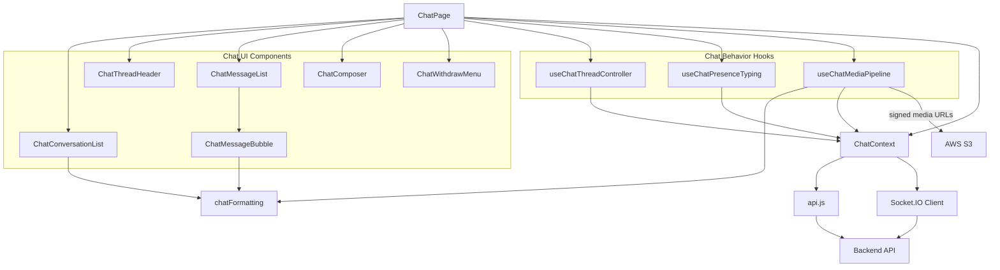
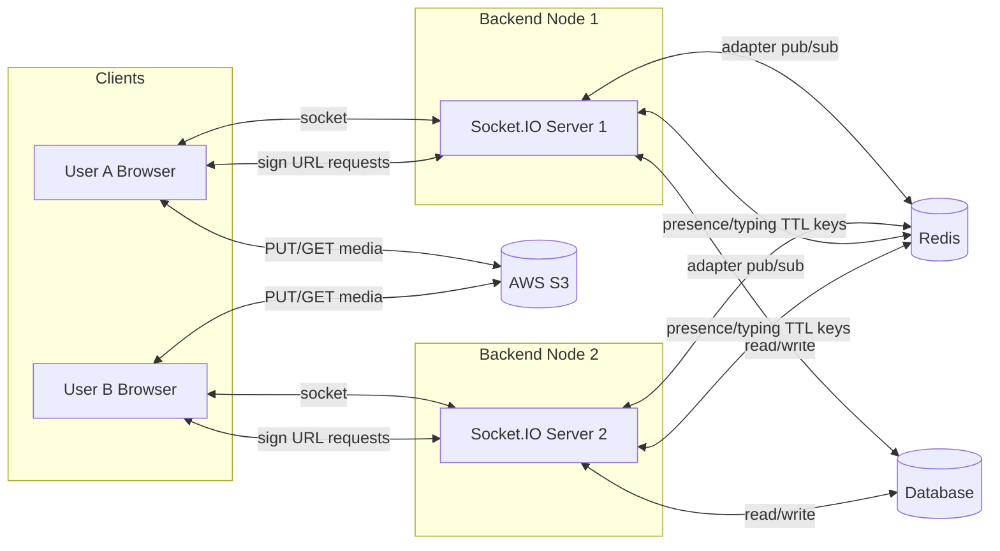
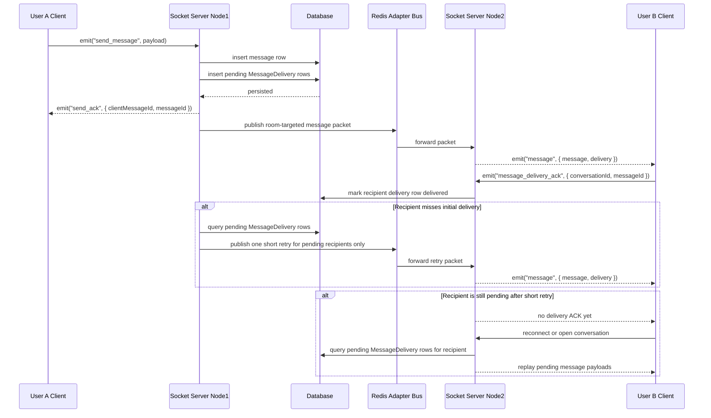
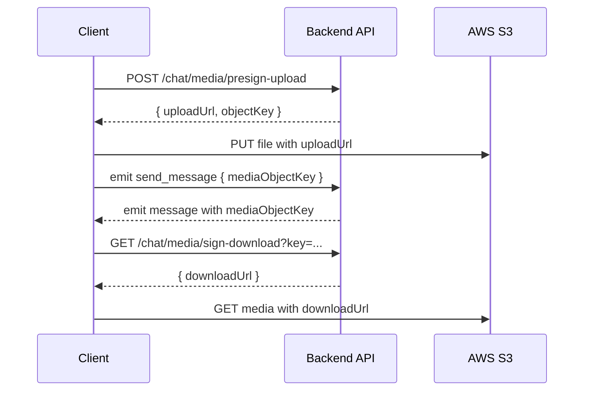
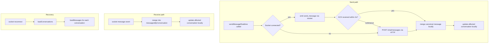

# Chat System Workflow (Scalable, Multi-Node)

This document describes the production workflow for chat in this project, with emphasis on multi-node behavior.

It covers:

- how JWT auth token is issued, stored, and sent by frontend
- when/where backend sockets are created
- why user-based rooms are used instead of conversation rooms
- how message send and fanout work across pods
- how media upload/download works with S3 signed URLs
- how presence and typing are stored and pushed
- how mark-as-read works and where unread counts are computed
- what Redis is responsible for vs what Socket.IO handles

---

## 0) Auth + read/unread data flow

## 0.1 Where `Authorization: Bearer <token>` comes from

Frontend does not mint JWT locally. Token source is backend login response.

Flow:

1. `POST /api/auth/login` validates credentials.
2. Backend signs JWT (`jwt.sign(...)`) and returns `{ user, token }`.
3. Frontend login API merges token into user object (`user.token = token`) for compatibility.
4. `AuthContext.login(user)` stores that user object in `localStorage` (`secondhand_user`).
5. Later chat API calls read `user.token` and send:
   - `Authorization: Bearer <token>`

Notes:

- Chat backend auth middleware verifies this JWT first.
- If token is missing/invalid, this project currently has a legacy fallback via identity headers.

## 0.2 Mark read + unread count model

Source of truth is backend DB/service logic; frontend only triggers updates and renders returned counts.

Mark-read flow:

1. User opens/switches conversation in `ChatPage`.
2. Frontend loads messages, takes latest message id, then calls:
   - `POST /chat/conversations/:id/read` with `lastReadMessageId`.
3. Backend upserts `ConversationReadState` for `(conversationId, userId)`:
   - `lastReadMessageId`
   - `lastReadMessageCreatedAt`
   - `readAt`

Unread count computation flow:

1. Frontend requests `GET /chat/conversations`.
2. Backend computes `unreadCount` per conversation:
   - only messages from others (`senderId != currentUserId`)
   - only messages newer than `lastReadMessageCreatedAt` (if exists)
3. Backend returns conversation list with `unreadCount`.
4. Frontend sums all `unreadCount` values for global chat badge.

Why compare against `lastReadMessageCreatedAt` (message sent time) instead of `readAt`:

- It correctly counts messages sent after the last read message, even if user marked read later.

## 0.3 Frontend architecture

The frontend chat flow is intentionally layered so UI rendering, page orchestration, chat-side effects, and transport details stay separate.

High-level responsibilities:

1. `ChatPage.jsx` acts as the page coordinator.
2. Presentational components under `client/src/components/chat/` render the sidebar, header, thread, composer, and context menu.
3. Focused hooks under `client/src/hooks/chat/` manage one behavior cluster each:
   - `useChatThreadController`: message hydration, read state, older-message pagination
   - `useChatPresenceTyping`: presence refresh and typing lifecycle
   - `useChatMediaPipeline`: signed media URLs, video visibility, lazy media loading
4. `ChatContext.jsx` is the frontend chat boundary:
   - owns chat state shared across the app
   - exposes chat operations to pages/hooks
   - hides direct `api.js` and socket usage from the UI layer
5. `api.js` performs raw HTTP calls, while Socket.IO in `ChatContext` handles realtime events.

Frontend data flow:

Why this split is useful:

- `ChatPage` stays readable because it composes smaller UI blocks and hooks instead of owning every effect directly.
- Hooks remain easier to reason about because each one groups a single workflow instead of hiding all chat logic inside one giant custom hook.
- Components stay mostly presentational, so layout changes usually do not require touching transport or socket logic.
- `ChatContext` remains the single frontend boundary for authenticated chat operations, which keeps `api.js` and socket wiring out of the page/component layer.

---

## 1) Startup and socket lifecycle

## 1.1 Backend startup sequence

For each backend node/pod:

1. HTTP server starts.
2. `initChatSocket(httpServer)` creates a Socket.IO server.
3. `io.use(authenticateSocket)` enables auth on each incoming socket handshake.
4. `tryAttachRedisAdapter(io)` attaches the Redis adapter when Redis is available.

Result: each node has an independent Socket.IO server, and all nodes are bridged by Redis adapter pub/sub when enabled.

## 1.2 When a user room is created

A user room is created lazily by Socket.IO when the first socket joins:

1. Client opens `/chat` and connects socket with auth token.
2. Backend `connection` handler reads authenticated `userId`.
3. Backend runs `socket.join("user:<userId>")`.

You do not pre-create rooms in Redis or DB. Room existence is managed by Socket.IO internally.

## 1.3 Why room key is `user:<userId>` (not `conversation:<id>`)

Room key and authorization are intentionally separate:

- **Authorization / recipient selection** comes from DB conversation participants.
- **Delivery transport** uses user rooms (`user:<id>`).

Backend flow:

1. Query participant user IDs for `conversationId`.
2. Emit to each participant's room `user:<id>`.

Benefits:

- one user with multiple tabs/devices receives event on all sockets
- same mechanism works for direct user events (presence/typing/message)
- no frequent join/leave churn when user opens/closes chat threads

---

## 2) Scalable architecture (2-node example)

Key responsibilities:

- **Socket.IO Redis adapter**: cross-node event fanout.
- **Redis key-value**: ephemeral state (presence/typing TTL keys).
- **Database**: durable source of truth for messages/conversations.
- **S3**: media object storage.

---

## 3) Conversation and message delivery

## 3.1 Conversation creation (HTTP)

Client calls `POST /chat/conversations`.

Backend:

1. validates users/context fields
2. creates or finds existing conversation
3. invalidates relevant conversation caches
4. returns `conversationId`

No socket event is required for creation itself; frontend can hydrate list afterward.

## 3.2 Message send (Socket) end-to-end

Client emits:

- `send_message`
- payload: `{ conversationId, type, content | mediaObjectKey, clientMessageId }`

Backend `send_message` handler:

1. validates sender belongs to conversation
2. writes message once to DB (`sendMessage(...)`)
3. creates `MessageDelivery` rows in `pending` state for recipients
4. sends ack to sender: `send_ack { clientMessageId, messageId }`
5. clears sender typing state
6. loads participant user IDs from DB
7. emits `message { message, delivery }` to each `user:<participantId>` room // room contains all sockets for the user
8. if some recipients are still `pending`, schedules one short retry and then leaves any remaining pending rows for later activity-based replay

`delivery` is a compact metadata object:

- `{ conversationId, messageId }`
- it exists so the recipient can emit `message_delivery_ack` without re-deriving identifiers from UI state

When a recipient receives the `message` event:

1. frontend merges the message into local conversation state
2. if the message came from another user and is not withdrawn, frontend emits `message_delivery_ack`
3. backend marks that recipient's `MessageDelivery` row as `delivered`

Plain-English workflow:

1. User A sends `send_message`.
2. Server saves the message to DB.
3. Server creates recipient `MessageDelivery` rows with status `pending`.
4. Server sends `send_ack` back to User A.
   - this ACK means the server persisted the message
   - it does **not** mean the recipient has received it yet
5. Server emits `message { message, delivery }` to conversation peers.
6. Server checks whether any recipient delivery rows are still `pending`.
7. If some recipients are still pending, server schedules one short retry.
8. If recipients are still pending after that retry, server leaves them pending until receiver activity triggers replay.
9. If User B receives the message, User B's client emits `message_delivery_ack`.
10. Backend handles that ACK by calling `markMessageDeliveryDelivered(...)`.
11. That recipient's delivery row becomes `delivered`, and later retries/replays skip it.

Replay coalescing / rate limiting:

- activity-based replay is guarded per recipient on each backend node
- if a replay for that recipient is already in progress, the new trigger is skipped
- if the same recipient was replayed very recently, the new trigger is skipped
- this prevents replay storms such as:
  - reconnect replay
  - followed immediately by `presence_subscribe`
  - plus multiple tabs reconnecting at nearly the same time

Important: DB write happens once on the node that handled `send_message`. Other nodes only forward packet to local sockets.

### Message fanout sequence (User A on Node1, User B on Node2)

```mermaid
  flowchart TD
    subgraph connect ["Connect"]
      C1[User connects socket] --> C2[Set Redis presence TTL]
      C2 --> C3[Start heartbeat refresh]
      C3 --> C4[Emit presence_changed online to peers]
      C4 --> C5[Push current peer status to new user]
    end

    subgraph disconnect ["Disconnect"]
      D1[User disconnects] --> D2[Remove local socket]
      D2 --> D3{Any sockets left?}
      D3 -->|s19| D4[Keep user online]
      D3 -->|s20| D5[Clear typing state]
      D5 --> D6[Emit presence_changed offline to peers]
    end

    subgraph snapshot ["Snapshot recovery"]
      S1[Conversation open / reconnect / focus] --> S2[Client emits presence_subscribe]
      S2 --> S3[Backend reads peer status from Redis]
      S3 --> S4[Returns presence snapshot + typing users]
    end
```

---

## 4) Redis pub/sub in this system

You are not manually publishing receiver IDs with raw Redis commands.

There is no custom logic like:

- `PUBLISH receiverId payload`

Instead:

1. backend calls `io.to("user:<id>").emit(...)`
2. Socket.IO adapter serializes packet and publishes on its internal Redis channels
3. other nodes' adapters subscribed to those channels receive packet
4. receiving node emits to local sockets in target room

So Redis pub/sub is a transport mechanism owned by the Socket.IO adapter.

Important clarification:

- Redis is **not** used as a manual "socket room registry" in this app.
- Room membership still lives inside Socket.IO (`socket.join("user:<id>")`).
- Redis adapter only bridges room emits across nodes.

Cluster behavior example:

- Node A local room map might have `user:1 -> {socketA1}`
- Node B local room map might have `user:1 -> {socketB7}`
- these room maps are **not merged** into one global socket list
- when Node A emits to `user:1`, adapter publishes a room-targeted packet via Redis
- every node receives packet and checks its **own local** `user:1` room
- nodes with matching local sockets deliver; nodes without matches ignore

## 4.1 Redis usage by feature (what Redis is for)

- **Socket fanout across nodes**: Socket.IO adapter pub/sub transport for `io.to("user:<id>").emit(...)`.
- **Presence**: Redis TTL key `chat:presence:<userId>` stores short-lived online heartbeat state.
- **Typing**: Redis TTL keys store short-lived typing state:
  - `chat:typing:<conversationId>:<userId>`
  - `chat:typing:<userId> -> <conversationId>` (active conversation pointer)
- **Conversations/messages API cache**: Redis stores JSON cache entries with TTL for list/history endpoints.

### 4.2 Who reads/writes Redis (and who does not)

- Frontend never connects to Redis directly.
- Backend service/socket layers are the only Redis readers/writers.
- Frontend gets Redis-backed results indirectly through:
  - REST responses (conversation/message cache hits)
  - socket snapshot callback (`presence_subscribe`)
  - socket push events (`presence_changed`, `typing_changed`)

### 4.3 Redis role matrix by feature

| Feature | Redis used for | Who writes Redis | Who reads Redis | If Redis is unavailable |
|---|---|---|---|---|
| Socket message/presence/typing fanout across pods | Socket.IO adapter pub/sub transport | Socket.IO adapter internals | Socket.IO adapter internals | Same-node emits still work; cross-node delivery degrades |
| Presence | TTL heartbeat key `chat:presence:<userId>` | backend socket heartbeat on connect/interval | backend on `presence_subscribe` snapshot | Falls back to local in-memory socket presence only |
| Typing | TTL keys for active typers and active conversation pointer | backend on `typing` start/stop, send, disconnect | backend on `presence_subscribe` snapshot | Live push still works; snapshot quality degrades |
| Conversations/messages API cache | JSON cache with TTL and invalidation | backend conversation/message services | backend conversation/message services | Falls back to DB reads/writes |

Without Redis:

- same-node socket delivery still works
- cross-node fanout degrades
- typing/presence snapshot quality degrades (event push may still work on same node)

---

## 5) Media upload/download (S3 direct path)

Binary media does not pass through backend app memory. Backend performs auth + signing only.

## 5.1 Upload workflow

1. Client calls `POST /chat/media/presign-upload` with:
   - `conversationId`
   - `mimeType`
   - `size`
   - optional file extension
2. Backend validates:
   - authenticated user is conversation participant
   - MIME type allowed
   - size within limit
3. Backend generates object key:
   - `chat/conversations/<conversationId>/users/<userId>/<uuid>.<ext>`
4. Backend signs `PutObject` and returns:
   - `uploadUrl`
   - `objectKey`
   - expiry seconds
5. Client uploads file directly to S3 using `PUT uploadUrl`.
6. Client sends chat message with `mediaObjectKey = objectKey`.

## 5.2 Download workflow

1. Message row includes `mediaObjectKey`.
2. Client requests `GET /chat/media/sign-download?key=<mediaObjectKey>`.
3. Backend parses conversation ID from key path and re-checks participant authorization.
4. Backend signs `GetObject` and returns short-lived `downloadUrl`.
5. Client fetches media directly from S3 with `downloadUrl`.

### Media sequence

---

## 6) Presence workflow (Redis TTL + socket push)

Presence key:

- `chat:presence:<userId> = "1"` with TTL

On socket connect:

1. set presence key with TTL
2. start heartbeat interval to refresh key
3. notify peers with `presence_changed { userId, isOnline: true }`
4. push current peer presence TO the newly connected user:
   - backend queries all conversation peers for the connecting user
   - backend reads presence keys for those peers via `getPresenceByUserIds`
   - backend emits `presence_changed { userId: <peerId>, isOnline }` directly to the connecting socket for each peer
   - this ensures the new user immediately knows who is already online, without relying on the `presence_subscribe` ACK (see 6.3)

On disconnect:

1. remove socket from in-memory map
2. if user has no remaining sockets, emit `isOnline: false` to peers
3. clear typing state for safety

Presence snapshot:

- client emits `presence_subscribe { conversationId }`
- backend validates participant
- backend returns:
  - `presenceByUserId`
  - `typingUserIds`

When frontend calls `presence_subscribe` (through `requestConversationPresence`):

- when selected conversation changes
- when socket transitions to connected/reconnected
- when browser window regains focus

The `presence_subscribe` ACK has a client-side timeout (3 s). If the ACK is not received in time the promise resolves with `null` and the client falls back to presence data from `presence_changed` events. See 6.3 for why this timeout exists.

There is no periodic 15s polling loop now.

### 6.1 Immediate offline update (without reopening conversation)

Yes, user A can see user B become offline immediately while staying in the same open chat.

Flow:

1. B disconnects (tab close/network drop/app background disconnect).
2. B's backend socket handler runs `disconnect`.
3. Backend removes that socket from local `userSockets`.
4. If B has no remaining sockets, backend calls peer notify:
   - emits `presence_changed { userId: B, isOnline: false }`
   - targets peers' user rooms (`user:<peerId>`)
5. A's frontend already listening on socket receives `presence_changed`.
6. A updates local `presenceByUserId[B] = false` and header renders `Offline` immediately.

So this immediate change is push-driven by `presence_changed`, not by reopening the conversation.

### 6.2 Why presence relies on `presence_changed` push, not `presence_subscribe` ACK

When the Redis adapter is active, Socket.IO acknowledgement callbacks for server-side `async` handlers can be silently dropped in certain edge cases (e.g. timing between adapter pub/sub and the callback serialization). This was observed in production-like testing: the backend logged a successful response, but the client ACK callback never fired, leaving the `requestConversationPresence` promise hanging indefinitely.

Because of this, the system treats `presence_changed` events as the **primary** channel for presence updates, not the `presence_subscribe` ACK:

1. **On connect push (backend → connecting client):**
   When a user connects, the backend immediately reads peer presence from Redis and emits individual `presence_changed` events directly to the connecting socket. This is a point-to-point `socket.emit` (not a room broadcast), which is not affected by the adapter ACK issue.

2. **Peer connect/disconnect push (backend → existing peers):**
   When a user connects or disconnects, the backend emits `presence_changed` to all peer user rooms. This uses the adapter for cross-node delivery, which works reliably for regular events.

3. **Snapshot ACK (best-effort fallback):**
   The `presence_subscribe` ACK is still emitted by the backend and processed by the client when it arrives. The client applies a 3-second timeout so a lost ACK never blocks the UI. When it does arrive, it merges into state as a consistency check.

Result: presence is accurate on first load and updates in real time, even when the ACK channel is unreliable.

### 6.3 Role of Redis in presence

Redis has two different roles here:

1. **Cross-node delivery transport (Socket.IO adapter)**  
   - backend emits to room `user:<peerId>`
   - adapter publishes packet through Redis pub/sub
   - peer node(s) receive and deliver to local sockets  
   This is what makes A still get B's offline event when A and B are connected to different pods.

2. **Presence snapshot state (TTL key-value)**  
   - backend writes heartbeat key: `chat:presence:<userId> = "1"` with TTL
   - backend reads these keys on `presence_subscribe` to build `presenceByUserId` snapshot  
   This helps recover state on reconnect/focus/conversation switch and avoids stale online state.

Important distinction:

- `presence_changed` = real-time delta push (immediate UI updates)
- `presence_subscribe` = snapshot sync (state recovery)
- frontend never reads Redis directly; backend is the only Redis reader/writer

### 6.4 Presence behavior without Redis

Presence still works, but in degraded mode.

What still works:

- backend can still emit `presence_changed` to user rooms
- frontend still updates immediately when it receives push events
- same-node users (both sockets on the same backend instance) continue to work well

What degrades:

- cross-node fanout is weaker without the Redis adapter
  - if A is on node1 and B is on node2, B's offline event may not reach A
- snapshot quality is weaker
  - backend cannot read Redis heartbeat keys on `presence_subscribe`
  - it falls back to local in-memory socket map (`userSockets`) on the current node only
  - that local map cannot see sockets connected to other nodes

Practical impact:

- in single-node dev: presence usually behaves normally
- in multi-node deployment without Redis: online/offline can appear inconsistent across pods

---

## 7) Typing workflow (Redis TTL + event push + client-side expiry)

Typing keys:

- per-conversation key: `chat:typing:<conversationId>:<userId>` (TTL)
- active-conversation pointer: `chat:typing:<userId> -> <conversationId>` (TTL)

## 7.1 Start typing

Client emits `typing { conversationId, isTyping: true }`.

Client-side refresh behavior:

- on entering typing state, client emits `typing=true` immediately
- while user continues typing, client sends throttled refresh emits (about every 2.5s) to keep Redis typing TTL alive
- on idle/send/switch/disconnect, client emits `typing=false`

Backend:

1. validates sender is a participant
2. checks if user was typing in another conversation
3. if yes, clears old conversation typing and emits `typing_changed false` to old peers
4. sets new Redis typing keys with TTL
5. emits typing_changed { conversationId, userId, isTyping, expiresInSeconds } to participants in this conversation only.

## 7.2 Stop typing

Triggered by:

- explicit `typing { isTyping: false }`
- successful `send_message`
- disconnect cleanup

Backend:

1. deletes per-conversation typing key
2. clears active conversation key when matching
3. emits `typing_changed { isTyping: false }` to conversation peers

## 7.3 Expiry behavior (important nuance)

There is no backend polling loop that checks every 2 seconds and emits `notTyping`.

Instead:

1. backend emits `typing_changed` with `expiresInSeconds`
2. frontend starts a local timer for `(conversationId, userId)`
3. if no refresh event arrives before timer expiry, frontend clears typing indicator locally

So:

- Redis TTL protects shared state correctness across pods
- client refresh emits keep typing TTL alive while user is actively typing
- frontend timer protects UI from stale typing indicators without backend polling

Clarification about scope:

- the explicit snapshot/query path is current-conversation only
  - `ChatPage` calls `requestConversationPresence(selectedChat)` for the open thread
- but frontend state is still stored per conversation
  - socket `typing_changed` events include `conversationId`
  - client keeps `typingByConversation[conversationId][userId]`
- this does not mean the backend broadcasts one conversation's typing state to unrelated users
  - backend fanout is still conversation-scoped
  - only participants of that conversation receive the `typing_changed` event
  - over time, one logged-in user may accumulate local typing state for multiple conversations they participate in
- this lets the app handle push events, quick conversation switching, and cleanup of old conversation typing state correctly

Performance note:

- this does **not** mean the client repeatedly queries typing status for every conversation
- only the currently selected conversation is explicitly queried/snapshotted
- typing state for other conversations is updated only when a relevant socket push event arrives
- those updates are small in-memory state changes, not extra HTTP requests or Redis reads from the browser
- typing emits are already bounded
  - only sent while someone is actively typing
  - throttled to about every 2.5s
  - delivered only to participants of that conversation
- in other words: the system pays a small memory/event cost to avoid slower conversation switching and to keep state correct across tabs/pods

Important:

- frontend never reads Redis directly
- backend reads/writes Redis typing keys
- frontend only receives socket events + snapshot results from backend
- backend does not poll Redis every few seconds to push typing updates; updates are event-driven

## 7.4 Typing behavior when Redis is unavailable

Typing still works in degraded mode:

1. sender emits `typing`
2. backend emits `typing_changed` to peers
3. receiver UI uses `expiresInSeconds` to auto-clear stale typing locally

In no-Redis mode, if user B opens a conversation after user A already emitted `typing=true`,
B can miss that current typing state until a fresh `typing_changed` event is sent.

---

## 8) Cross-node example (A on Node1, B on Node2)

Assume both users are in conversation `c1`.

1. A starts typing on Node1:
   - Node1 writes typing TTL keys in Redis
   - Node1 emits `typing_changed true` to B's user room
   - adapter propagates to Node2; Node2 delivers to B's socket
2. A sends message on Node1:
   - Node1 writes DB once
   - Node1 emits `message` to participant user rooms
   - adapter propagates to Node2 for B delivery
   - Node1 emits `typing_changed false`
3. B receives both events in Node2:
   - typing indicator clears
   - message appears in chat UI

This is how sockets on different nodes stay consistent without duplicate DB writes.

---

## 9) Message synchronization

Message synchronization ensures every participant's UI stays up to date with the latest messages and conversation metadata. The system uses a layered approach: socket push for immediacy, post-action REST sync for consistency, and reconnect sync for recovery.

### 9.1 Primary channel: socket `message` push

When a message is sent via socket (`send_message`), the backend:

1. persists the message to DB (single write)
2. creates recipient delivery rows in `pending` state
3. emits `send_ack` back to sender
4. emits `message { message, delivery }` to every participant's user room (`user:<id>`)
5. performs one short retry for recipients still in `pending` state
6. leaves any still-undelivered recipients in `pending` state for activity-triggered replay

Frontend `ChatContext` listens for the `message` event:

1. merges the incoming message into `messagesByConversation` state (deduplication by message id)
2. if the message was sent by another user and is not withdrawn, emits `message_delivery_ack`
3. calls `loadConversations()` to refresh the conversation list (last message preview, unread counts)

This gives real-time message appearance without polling.

### 9.2 Send path: socket-first with HTTP fallback

`sendMessageRealtime` in `ChatContext` attempts delivery via socket with a 4-second ACK timeout:

1. if socket is connected, emit `send_message` and wait for ACK
2. if ACK arrives: message was persisted and fanned out by the backend socket handler (full fanout to all participants)
3. if ACK times out or socket is disconnected: fall through to `POST /chat/messages` HTTP endpoint
4. HTTP endpoint persists the message to DB and then uses the same realtime delivery helper to fan out + do one short retry + preserve pending delivery state

After either path succeeds, the sender calls:

- `loadMessages(conversationId)` — fetches latest messages from DB to ensure local state includes the server-generated message
- `loadConversations()` — refreshes conversation list for updated last message and unread counts

### 9.3 Delivery ACK + hybrid retry/replay behavior

Recipient delivery is tracked separately from sender persistence ACK:

1. sender receives `send_ack` after the message is persisted
2. recipient receives `message { message, delivery }`
3. recipient emits `message_delivery_ack`
4. backend marks that `(messageId, recipientId)` delivery row as `delivered`
5. if some recipients are still `pending`, backend performs one short retry for that message
6. if some recipients remain `pending` after the short retry, backend keeps those delivery rows unchanged
7. when the receiver reconnects or opens/subscribes to a conversation, backend replays pending messages for that receiver
8. both retries and replays only target deliveries whose rows are still `pending`
9. activity-triggered replays are coalesced per recipient so repeated triggers on the same node do not cause replay storms

This gives the system a hybrid at-least-once style recovery path: one quick retry for transient loss plus activity-driven replay for longer gaps.

### 9.4 Reconnect sync

When the socket reconnects after a disconnection, `ChatContext` runs a full sync:

1. `loadConversations()` — fetches the latest conversation list from DB
2. for each conversation, `loadMessages(conversationId)` — fetches messages and merges them into local state

At the same time, backend socket connect logic can replay pending deliveries for that user, and `presence_subscribe` can replay pending deliveries for the active conversation if anything remains pending after the short retry.

This closes the gap for any messages missed during the disconnection window.

### 9.5 Conversation switch sync

When the user selects a different conversation in `ChatPage`:

1. `loadMessages(selectedChat)` is called to hydrate messages for that conversation
2. the latest message is used to call `markAsRead(selectedChat, latestMessageId)`
3. `markAsRead` calls `loadConversations()` afterward to refresh unread counts

### 9.6 Message merge and deduplication

All `loadMessages` calls go through `mergeMessages` in `ChatContext`:

1. existing messages for the conversation are indexed by id into a `Map`
2. incoming messages are merged in (overwriting by id if duplicate)
3. result is sorted by `createdAt` ascending

This guarantees:

- duplicate messages from overlapping socket push + REST sync do not appear twice
- withdrawn messages (updated in DB) are reflected when their row is re-fetched
- ordering remains consistent regardless of arrival order

### 9.7 Withdraw sync

When a message is withdrawn:

- if socket is connected: emit `withdraw_message`, then `loadMessages(conversationId)` to fetch the updated row
- if socket is disconnected: `POST /chat/messages/:id/withdraw` HTTP route, updated message returned directly

After either path, `loadConversations()` is called to refresh the conversation list.

Backend socket handler for `withdraw_message` re-emits the updated message to all participants via `message` event, so other participants see the withdrawal in real time (socket path only).

### 9.8 No background polling for messages

There is no periodic polling loop that fetches messages or conversations on a timer. Message synchronization relies entirely on:

- socket `message` push events (primary real-time channel)
- local merge of canonical message payloads returned by send/withdraw ACKs
- reconnect sync for missed live events (recovery)

This keeps HTTP traffic low and avoids request pile-up under load.

### 9.9 Sync flow summary

---

## 10) Reliability and fallback behavior

- If Redis adapter is down, cross-node fanout is degraded; same-node delivery still works.
- If Redis key-value is unavailable, presence/typing degrade to partial in-memory + event-only behavior:
  - live push events can still update UI
  - snapshot recovery (`typingUserIds`) is weaker
  - users joining mid-typing may miss existing typing state
- Message durability remains because message writes are committed to DB.
- Reconnect path in frontend re-syncs conversations/messages to recover missed live events.

Quick mental model:

- Socket.IO push = immediate UI updates
- Redis TTL keys = shared short-lived truth and snapshot recovery
- frontend timers = stale-indicator safety net
- DB = durable source of truth

### 10.1 Current status against the article's concerns

| Concern from article | Current status | What is implemented now | Remaining limitation |
| --- | --- | --- | --- |
| Delivery guarantee / "can B still receive after a brief disconnect?" | **Partial** | Messages are persisted first, per-recipient `MessageDelivery` rows are created, recipients ACK with `message_delivery_ack`, server marks delivered, does one short retry, then replays pending deliveries on reconnect or `presence_subscribe`. Client merges by message id, so duplicate emits do not duplicate UI rows. | This is strong application-level at-least-once, but not exactly-once. Replay coalescing is node-local in memory, and there is no per-device delivered watermark yet. |
| Message ordering / "do both users see the same order?" | **Handled** | Server allocates a per-conversation `sequenceNumber` atomically during message write, backend pagination uses sequence cursors, and client merge/sort prefers `sequenceNumber`. | Older unread-count logic still compares `createdAt` for read tracking; ordering for message lists is sequence-based, but read-state math is not yet sequence-based. |
| Offline message sync / reconnect recovery | **Partial** | Reconnect path loads conversations and fetches messages after the latest loaded sequence. Pending deliveries are replayed on connect and when the recipient activates a conversation. | Recovery is driven by activity/reconnect, not by a persistent per-device last-delivered checkpoint, so replay scope is broader than necessary. |
| Horizontal scaling / "A on node1, B on node2" | **Handled** | Socket.IO Redis adapter fans out room-targeted events across nodes. Durable truth remains in DB, presence/typing snapshots use Redis TTL keys. | Cross-node message fanout is covered, but replay coalescing is not cluster-wide yet because the guard is still in local memory. |
| Connection management / cleanup | **Partial** | Presence and typing use TTL-backed keys, disconnect cleanup removes local socket state, and client-side timers clear stale typing UI. | If Redis is unavailable, presence/typing snapshot recovery degrades; some edge behavior falls back to best effort until Redis returns. |

### 10.2 Smallest remaining hardening steps

1. Move replay coalescing from per-node memory to Redis so multiple nodes cannot trigger the same recipient replay burst.
2. Add a per-device or per-session "last delivered sequence number" checkpoint so reconnect recovery can request only the exact missing range instead of replaying all still-pending deliveries.
3. Move unread/read tracking from `createdAt` comparisons to `sequenceNumber` comparisons so read state and ordering use the same monotonic source of truth.
4. Add operational visibility for long-pending deliveries (metrics/logging or a small sweeper job) so "stuck pending forever" cases are observable.

---

## 11) Event contract (frontend <-> backend)

Client -> Server:

- `send_message`
- `message_delivery_ack`
- `typing`
- `presence_subscribe`
- `withdraw_message`

Server -> Client:

- `message`
- `send_ack`
- `typing_changed`
- `presence_changed`

Recommended frontend handling:

- treat socket events as immediate UI updates
- run REST/message sync on reconnect for eventual consistency

Recommended payloads:

- `send_message`
  - `{ conversationId, type, content | mediaObjectKey, clientMessageId }`
- `message_delivery_ack`
  - `{ conversationId, messageId }`
  - sent by the recipient after a `message` event is received
  - current server handler validates membership and acknowledges the ACK event itself; delivery-state mutation is handled separately
- `message`
  - `{ message, delivery }`
  - `delivery = { conversationId, messageId }`
  - `delivery` carries the stable identifiers the recipient uses when emitting `message_delivery_ack`
- `send_ack`
  - `{ clientMessageId, messageId, message }`
  - emitted back to the sender after the server persists the message
  - `message` is the canonical saved DB row, including server-assigned fields such as `sequenceNumber`

---

## 12) FAQ (from implementation review)

Q: Is Redis only storing socket rooms?
A: No. Socket rooms are managed by Socket.IO (`socket.join("user:<id>")`). Redis is used for:
- Socket.IO adapter pub/sub across nodes
- Presence TTL keys
- Typing TTL keys
- API cache (conversations/messages)

Q: If user sockets are on different nodes, does Redis build one shared room with all sockets?
A: No. Each node keeps only local room membership. Redis adapter broadcasts room-targeted emits, and each node checks/delivers to its own local sockets in that room.

Q: Does adapter publish userId and then each node checks local sockets?
A: Conceptually yes. The adapter publishes a room-targeted packet (for `user:<id>`) and each node's Socket.IO layer matches that room locally and emits to matching sockets.

Q: Why store typing/presence keys at all? Why not only push socket events?
A: Push-only works in ideal/single-node cases, but keys add:
- snapshot recovery after reconnect/tab focus/chat switch
- shared state across pods
- TTL-based cleanup for missed stop/disconnect events

Q: Does frontend read Redis directly when typing TTL expires?
A: No. Frontend never connects to Redis. It uses socket events and local timers. Backend reads Redis for snapshots.

Q: Who actually reads the cache/keys?
A: Backend only.
- API services read/write conversation/message caches.
- Socket handlers read/write presence/typing keys.

Q: Does backend poll Redis every few seconds and keep pushing typing updates?
A: Backend does not poll Redis. Updates are event-driven (`typing`, `send_message`, `disconnect`). The client may send throttled `typing=true` refresh emits while actively typing to keep TTL valid.

Q: Without Redis, does typing still work?
A: Yes, degraded mode:
- live `typing_changed` push still works (especially same-node)
- receiver still uses `expiresInSeconds` timer to auto-clear stale UI
- but snapshot reconstruction is weaker

Q: Without Redis, if B opens conversation while A is already typing, will B miss it?
A: Possibly yes. If B missed the earlier `typing=true` push, no Redis snapshot source exists to reconstruct it; B sees typing again on next fresh typing event.

Q: Why does the `presence_subscribe` ACK sometimes not arrive on the client?
A: When the Redis adapter is active, Socket.IO acknowledgement callbacks for async server handlers can be silently dropped in edge cases. The backend successfully calls `callback(response)` but the client never receives it. This is a known subtle interaction between the adapter pub/sub layer and the ACK serialization path. The system mitigates this by:
- pushing `presence_changed` events directly to the connecting socket on connect (primary channel)
- applying a 3-second client-side timeout on the ACK promise so it never blocks the UI
- treating the ACK as a best-effort consistency check rather than the sole presence source

Q: If B connects after A is already online, how does B know A is online?
A: On B's socket connect, the backend reads A's presence key from Redis and emits `presence_changed { userId: A, isOnline: true }` directly to B's socket. This is a point-to-point emit, not a room broadcast, so it is not affected by the adapter ACK issue. B's frontend receives this event and updates `presenceByUserId[A] = true` immediately.

Q: Where does frontend `user.token` come from?
A: From backend login response:
- backend `/api/auth/login` returns `{ user, token }`
- frontend stores token on user object and persists user in `localStorage`
- chat API client reads `user.token` to send `Authorization: Bearer <token>`

Q: Does ChatPage compute unread counts itself?
A: No. ChatPage triggers mark-read and renders conversation data. Backend computes `unreadCount` per conversation in chat service logic and returns it via `GET /chat/conversations`; frontend only sums/display counts.