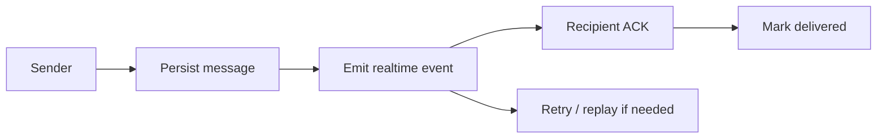
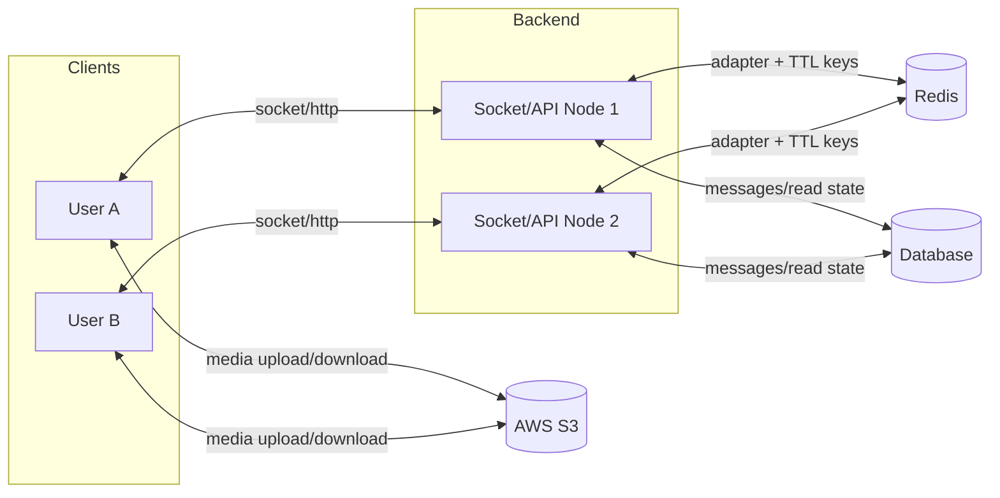
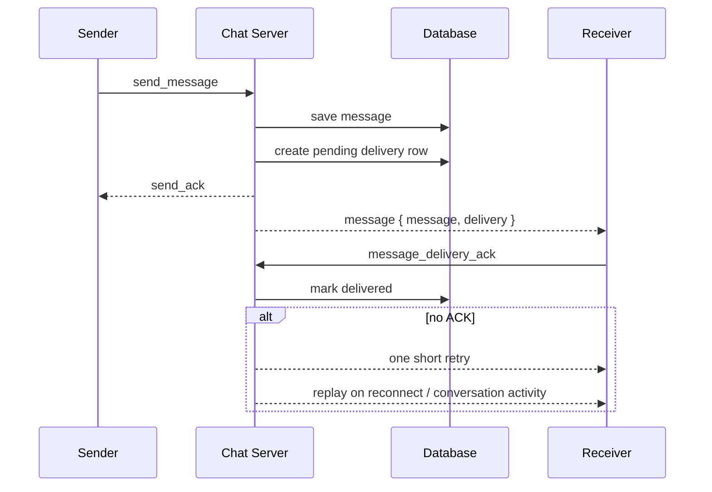
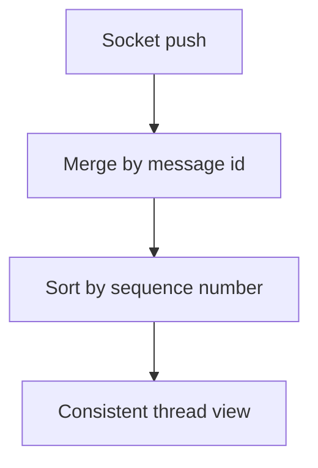
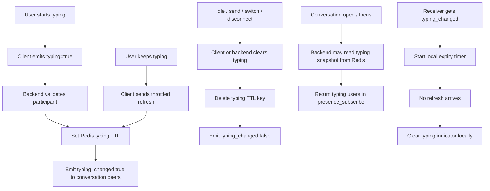

# Chat System Presentation

## 1. Project Objective

- Build a reliable real-time chat system for the marketplace
- Support 1:1 messaging, media, presence, typing, and unread state
- Keep the design correct under disconnects and multi-node deployment

**Stack**

- React
- Express + Socket.IO
- PostgreSQL/Prisma-style data model
- Redis
- AWS S3

---

## 2. What We Achieved

- Persistent chat history
- Real-time message delivery across nodes
- Delivery ACK + pending delivery tracking
- Per-conversation message ordering
- Reconnect sync and deduplication
- Presence and typing indicators
- Media messaging with signed S3 URLs
- Per-user hide/archive and unread counts

---

## 3. System Design

- DB = durable truth
- Redis = cross-node fanout + short-lived state
- S3 = direct media path

---

## 4. Reliable Message Flow

- Sender ACK means "saved", not "read"
- Delivery state is tracked per recipient
- Recovery uses retry + activity-based replay

---

## 5. Correctness Features

- Ordering:
  server assigns per-conversation `sequenceNumber`
- Sync:
  socket push + reconnect recovery + local merge/dedup
- Presence:
  socket push first, Redis-backed snapshot recovery
- Typing:
  socket events + Redis TTL + client expiry timer
- Media:
  backend signs, clients upload/download directly with S3

---

## 6. Presence Workflow

```mermaid
flowchart TD
  subgraph connect ["Connect"]
    C1[User connects socket] --> C2[Set Redis presence TTL]
    C2 --> C3[Start heartbeat refresh]
    C3 --> C4[Emit presence_changed online to peers]
    C4 --> C5[Push current peer status to new user]
  end

  subgraph disconnect ["Disconnect"]
    D1[User disconnects] --> D2[Remove local socket]
    D2 --> D3{Any sockets left?}
    D3 -- Yes --> D4[Keep user online]
    D3 -- No --> D5[Clear typing state]
    D5 --> D6[Emit presence_changed offline to peers]
  end

  subgraph snapshot ["Snapshot recovery"]
    S1[Conversation open / reconnect / focus] --> S2[Client emits presence_subscribe]
    S2 --> S3[Backend reads peer status from Redis]
    S3 --> S4[Returns presence snapshot + typing users]
  end
```

- Main UI updates come from `presence_changed`
- Redis is used for presence TTL storage and snapshot recovery
- On conversation open / reconnect / focus, backend reads peer status from Redis
- Frontend never talks to Redis directly

---

## 7. Typing Indicator Workflow

- Typing is conversation-scoped
- Redis stores short-lived typing state for snapshot/recovery
- Live typing UI mainly comes from `typing_changed`
- No backend polling loop
- Client timer prevents stale indicators

---

## 8. Demo Highlights

- Send text, image, and video messages
- Show unread counts and mark-read state
- Show online/offline presence
- Show typing indicators
- Recover missed messages after reconnect
- Keep conversations synced across backend nodes

---

## 9. Results Against the Original Risks

| Risk | Result |
| --- | --- |
| Message lost on brief disconnect | Reduced with persistence, ACK, retry, replay |
| Different order across users | Solved with server sequence numbers |
| Multi-node inconsistency | Solved with Socket.IO Redis adapter |
| Stale presence / typing | Reduced with TTL + push events |
| Large media through app server | Avoided with signed S3 path |

---

## 10. Next Improvements

- Move replay coalescing from node-local memory to Redis
- Track delivered/read progress fully by sequence number
- Add per-device recovery checkpoint
- Add metrics for long-pending deliveries

**Takeaway**

- The project is not just "Socket.IO chat"
- It is a reliability-focused chat system with recovery, ordering, and multi-node design
