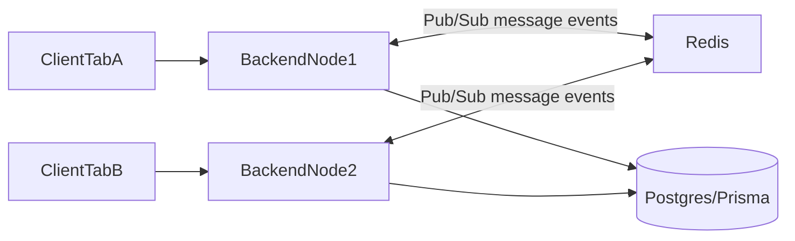

# Redis Next Steps for Chat

## Goals

- Support horizontal scaling for real-time chat.
- Reduce read load on Prisma/DB for chat APIs.
- Add low-latency ephemeral features (presence/typing).
- Keep current JWT/auth/message semantics unchanged.

## Phase 0: Foundation (Dev + Prod parity)

- Add Redis client/config module in backend (single source for URL/TLS/options), e.g. `backend/utils/redis.js`.
- Add environment variables to `.env.dev` and `.env.docker` templates for Redis URL/credentials.
- Add health logging and graceful fallback mode (if Redis unavailable, keep current behavior with warnings).
- Files to touch:
  - [backend/package.json](backend/package.json)
  - [backend/server.js](backend/server.js)
  - [backend/utils/s3.js](backend/utils/s3.js) (pattern reference only)
  - [start.sh](start.sh)

## Phase 1: Real-time scale-out first (highest ROI)

- Integrate Socket.IO Redis adapter so multiple backend instances broadcast chat events consistently.
- Wire adapter initialization in chat socket bootstrap.
- Keep current `userSockets` map for single-instance optimization; Redis adapter handles cross-instance fanout.
- Files to touch:
  - [backend/chat/websocket.js](backend/chat/websocket.js)
  - [backend/chat/index.js](backend/chat/index.js)
  - [backend/server.js](backend/server.js)

## Phase 2: Cache read-heavy endpoints

- Add Redis cache for:
  - `GET /api/chat/conversations`
  - `GET /api/chat/messages?conversationId=...`
- Use short TTLs (e.g., conversations 10–20s, messages 5–15s) and explicit invalidation on:
  - send message
  - withdraw message
  - mark read
  - create conversation
- Use namespaced keys (`chat:conv:user:{userId}`, `chat:msgs:{conversationId}:{cursor}:{limit}`).
- Files to touch:
  - [backend/chat/routes.js](backend/chat/routes.js)
  - [backend/chat/services/message.js](backend/chat/services/message.js)
  - [backend/chat/services/conversation.js](backend/chat/services/conversation.js)

## Phase 3: Presence + typing indicators (ephemeral Redis state)

- Presence keys with TTL heartbeat (`chat:presence:{userId}`), status lookup for conversation peers.
- Typing keys with short TTL (`chat:typing:{conversationId}:{userId}`), emitted via Socket.IO events.
- Expose minimal frontend handling in chat context/page.
- Files to touch:
  - [backend/chat/websocket.js](backend/chat/websocket.js)
  - [client/src/context/ChatContext.jsx](client/src/context/ChatContext.jsx)
  - [client/src/pages/ChatPage.jsx](client/src/pages/ChatPage.jsx)

## Phase 4: Operational hardening

- Add metrics (cache hit/miss, pub/sub reconnects, Redis latency).
- Add retry/backoff and circuit-breaker-like behavior for Redis outages.
- Add load test scenario with 2+ backend instances to verify cross-node delivery and unread consistency.

## Acceptance Criteria

- Multi-node chat: message/withdraw events arrive across instances.
- API latency and DB query volume drop on conversation/message reads.
- Presence/typing works with TTL expiry and no stale state > configured window.
- System remains functional when Redis is temporarily unavailable.